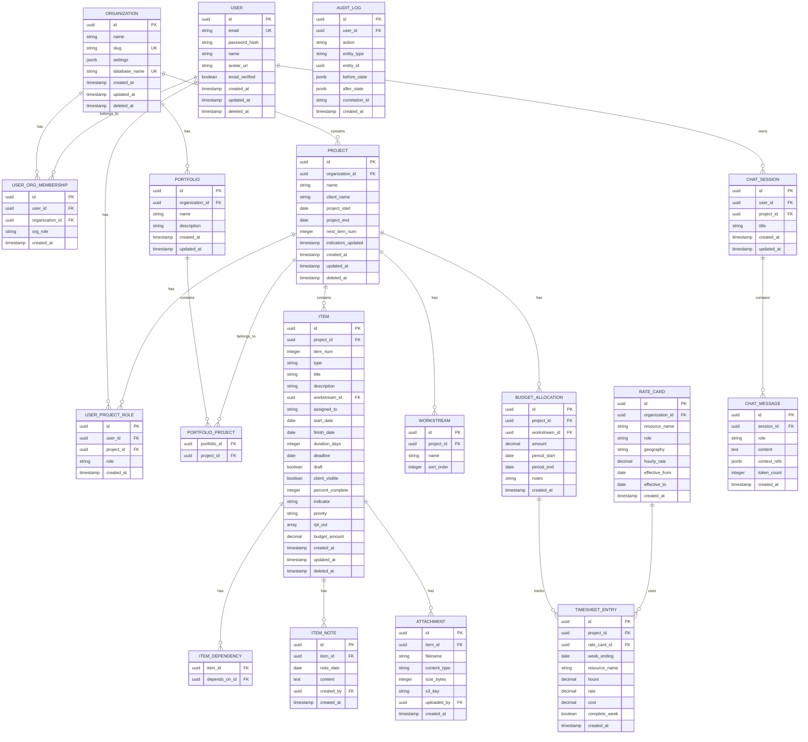

# braidMgr Logical Data Model

*Last updated: 2024-12-24*

This document defines the logical data model for braidMgr v2 with multi-tenant, multi-user support.

---

## Entity Relationship Diagram



---

## Entity Definitions

### Core Entities

#### ORGANIZATION

Represents a tenant with isolated data.

| Attribute | Type | Constraints | Description |
|-----------|------|-------------|-------------|
| id | UUID | PK | Unique identifier |
| name | VARCHAR(255) | NOT NULL | Display name |
| slug | VARCHAR(100) | UNIQUE, NOT NULL | URL-safe identifier |
| settings | JSONB | DEFAULT '{}' | Organization settings |
| database_name | VARCHAR(100) | UNIQUE, NOT NULL | Name of isolated database |
| created_at | TIMESTAMP | NOT NULL | Creation timestamp |
| updated_at | TIMESTAMP | NOT NULL | Last update timestamp |
| deleted_at | TIMESTAMP | NULL | Soft delete timestamp |

**Indexes**:
- `idx_organization_slug` on slug

---

#### USER

Application user (exists in central auth database).

| Attribute | Type | Constraints | Description |
|-----------|------|-------------|-------------|
| id | UUID | PK | Unique identifier |
| email | VARCHAR(255) | UNIQUE, NOT NULL | Email address |
| password_hash | VARCHAR(255) | NULL | Bcrypt hash (null for OAuth-only) |
| name | VARCHAR(255) | NOT NULL | Display name |
| avatar_url | VARCHAR(500) | NULL | Profile image URL |
| email_verified | BOOLEAN | DEFAULT false | Email verification status |
| created_at | TIMESTAMP | NOT NULL | Creation timestamp |
| updated_at | TIMESTAMP | NOT NULL | Last update timestamp |
| deleted_at | TIMESTAMP | NULL | Soft delete timestamp |

**Indexes**:
- `idx_user_email` on email

---

#### USER_ORG_MEMBERSHIP

Maps users to organizations with org-level role.

| Attribute | Type | Constraints | Description |
|-----------|------|-------------|-------------|
| id | UUID | PK | Unique identifier |
| user_id | UUID | FK(USER), NOT NULL | User reference |
| organization_id | UUID | FK(ORGANIZATION), NOT NULL | Organization reference |
| org_role | org_role_enum | NOT NULL | Organization-level role |
| created_at | TIMESTAMP | NOT NULL | Creation timestamp |

**Unique Constraint**: (user_id, organization_id)

---

#### PROJECT

A RAID log project within an organization.

| Attribute | Type | Constraints | Description |
|-----------|------|-------------|-------------|
| id | UUID | PK | Unique identifier |
| organization_id | UUID | FK(ORGANIZATION), NOT NULL | Parent organization |
| name | VARCHAR(255) | NOT NULL | Project name |
| client_name | VARCHAR(255) | NULL | Client/customer name |
| project_start | DATE | NULL | Planned start date |
| project_end | DATE | NULL | Planned end date |
| next_item_num | INTEGER | DEFAULT 1 | Auto-increment for item numbers |
| indicators_updated | TIMESTAMP | NULL | Last indicator recalculation |
| created_at | TIMESTAMP | NOT NULL | Creation timestamp |
| updated_at | TIMESTAMP | NOT NULL | Last update timestamp |
| deleted_at | TIMESTAMP | NULL | Soft delete timestamp |

**Indexes**:
- `idx_project_organization` on organization_id
- `idx_project_deleted` on deleted_at

---

#### PORTFOLIO

Flexible grouping of projects.

| Attribute | Type | Constraints | Description |
|-----------|------|-------------|-------------|
| id | UUID | PK | Unique identifier |
| organization_id | UUID | FK(ORGANIZATION), NOT NULL | Parent organization |
| name | VARCHAR(255) | NOT NULL | Portfolio name |
| description | TEXT | NULL | Description |
| created_at | TIMESTAMP | NOT NULL | Creation timestamp |
| updated_at | TIMESTAMP | NOT NULL | Last update timestamp |

**Indexes**:
- `idx_portfolio_organization` on organization_id

---

#### PORTFOLIO_PROJECT

Many-to-many relationship between portfolios and projects.

| Attribute | Type | Constraints | Description |
|-----------|------|-------------|-------------|
| portfolio_id | UUID | FK(PORTFOLIO), NOT NULL | Portfolio reference |
| project_id | UUID | FK(PROJECT), NOT NULL | Project reference |

**Primary Key**: (portfolio_id, project_id)

---

### Item Entities

#### ITEM

A RAID log item (Risk, Action, Issue, Decision, etc.).

| Attribute | Type | Constraints | Description |
|-----------|------|-------------|-------------|
| id | UUID | PK | Unique identifier |
| project_id | UUID | FK(PROJECT), NOT NULL | Parent project |
| item_num | INTEGER | NOT NULL | Display number (unique per project) |
| type | item_type_enum | NOT NULL | Item type |
| title | VARCHAR(500) | NOT NULL | Item title |
| description | TEXT | NULL | Detailed description |
| workstream_id | UUID | FK(WORKSTREAM), NULL | Associated workstream |
| assigned_to | VARCHAR(255) | NULL | Assignee name |
| start_date | DATE | NULL | Planned start |
| finish_date | DATE | NULL | Planned finish |
| duration_days | INTEGER | NULL | Duration in business days |
| deadline | DATE | NULL | Hard deadline |
| draft | BOOLEAN | DEFAULT false | Draft mode (hidden from views) |
| client_visible | BOOLEAN | DEFAULT true | Visible to client |
| percent_complete | INTEGER | DEFAULT 0, CHECK 0-100 | Completion percentage |
| indicator | indicator_enum | NULL | Calculated status indicator |
| priority | VARCHAR(50) | NULL | Priority level |
| rpt_out | TEXT[] | NULL | Report codes list |
| budget_amount | DECIMAL(12,2) | NULL | Budget amount (for Budget type) |
| created_at | TIMESTAMP | NOT NULL | Creation timestamp |
| updated_at | TIMESTAMP | NOT NULL | Last update timestamp |
| deleted_at | TIMESTAMP | NULL | Soft delete timestamp |

**Unique Constraint**: (project_id, item_num)

**Indexes**:
- `idx_item_project` on project_id
- `idx_item_type` on type
- `idx_item_indicator` on indicator
- `idx_item_assigned` on assigned_to
- `idx_item_deleted` on deleted_at

---

#### WORKSTREAM

Project workstreams for organizing items.

| Attribute | Type | Constraints | Description |
|-----------|------|-------------|-------------|
| id | UUID | PK | Unique identifier |
| project_id | UUID | FK(PROJECT), NOT NULL | Parent project |
| name | VARCHAR(255) | NOT NULL | Workstream name |
| sort_order | INTEGER | DEFAULT 0 | Display order |

**Unique Constraint**: (project_id, name)

---

#### ITEM_NOTE

Timestamped notes on items.

| Attribute | Type | Constraints | Description |
|-----------|------|-------------|-------------|
| id | UUID | PK | Unique identifier |
| item_id | UUID | FK(ITEM), NOT NULL | Parent item |
| note_date | DATE | NOT NULL | Date of note |
| content | TEXT | NOT NULL | Note content |
| created_by | UUID | FK(USER), NULL | Author |
| created_at | TIMESTAMP | NOT NULL | Creation timestamp |

**Indexes**:
- `idx_item_note_item` on item_id
- `idx_item_note_date` on note_date DESC

---

#### ITEM_DEPENDENCY

Dependencies between items.

| Attribute | Type | Constraints | Description |
|-----------|------|-------------|-------------|
| item_id | UUID | FK(ITEM), NOT NULL | Dependent item |
| depends_on_id | UUID | FK(ITEM), NOT NULL | Prerequisite item |

**Primary Key**: (item_id, depends_on_id)

---

#### ATTACHMENT

Files attached to items.

| Attribute | Type | Constraints | Description |
|-----------|------|-------------|-------------|
| id | UUID | PK | Unique identifier |
| item_id | UUID | FK(ITEM), NOT NULL | Parent item |
| filename | VARCHAR(255) | NOT NULL | Original filename |
| content_type | VARCHAR(100) | NOT NULL | MIME type |
| size_bytes | INTEGER | NOT NULL | File size |
| s3_key | VARCHAR(500) | NOT NULL | S3 object key |
| uploaded_by | UUID | FK(USER), NOT NULL | Uploader |
| created_at | TIMESTAMP | NOT NULL | Upload timestamp |

**Indexes**:
- `idx_attachment_item` on item_id

---

### Access Control Entities

#### USER_PROJECT_ROLE

User role assignment per project.

| Attribute | Type | Constraints | Description |
|-----------|------|-------------|-------------|
| id | UUID | PK | Unique identifier |
| user_id | UUID | FK(USER), NOT NULL | User reference |
| project_id | UUID | FK(PROJECT), NOT NULL | Project reference |
| role | project_role_enum | NOT NULL | Project role |
| created_at | TIMESTAMP | NOT NULL | Creation timestamp |

**Unique Constraint**: (user_id, project_id)

---

### Budget Entities

#### RATE_CARD

Resource billing rates.

| Attribute | Type | Constraints | Description |
|-----------|------|-------------|-------------|
| id | UUID | PK | Unique identifier |
| organization_id | UUID | FK(ORGANIZATION), NOT NULL | Parent organization |
| resource_name | VARCHAR(255) | NOT NULL | Resource/person name |
| role | VARCHAR(100) | NULL | Role/title |
| geography | VARCHAR(100) | NULL | Location/geography |
| hourly_rate | DECIMAL(10,2) | NOT NULL | Hourly billing rate |
| effective_from | DATE | NOT NULL | Rate effective start |
| effective_to | DATE | NULL | Rate effective end (null = current) |
| created_at | TIMESTAMP | NOT NULL | Creation timestamp |

**Indexes**:
- `idx_rate_card_org` on organization_id
- `idx_rate_card_resource` on resource_name

---

#### BUDGET_ALLOCATION

Budget allocated to project workstreams/phases.

| Attribute | Type | Constraints | Description |
|-----------|------|-------------|-------------|
| id | UUID | PK | Unique identifier |
| project_id | UUID | FK(PROJECT), NOT NULL | Parent project |
| workstream_id | UUID | FK(WORKSTREAM), NULL | Workstream (optional) |
| amount | DECIMAL(12,2) | NOT NULL | Allocated amount |
| period_start | DATE | NULL | Period start |
| period_end | DATE | NULL | Period end |
| notes | TEXT | NULL | Allocation notes |
| created_at | TIMESTAMP | NOT NULL | Creation timestamp |

**Indexes**:
- `idx_budget_allocation_project` on project_id

---

#### TIMESHEET_ENTRY

Actual time/cost entries.

| Attribute | Type | Constraints | Description |
|-----------|------|-------------|-------------|
| id | UUID | PK | Unique identifier |
| project_id | UUID | FK(PROJECT), NOT NULL | Parent project |
| rate_card_id | UUID | FK(RATE_CARD), NULL | Rate card used |
| week_ending | DATE | NOT NULL | Week ending date |
| resource_name | VARCHAR(255) | NOT NULL | Resource name |
| hours | DECIMAL(6,2) | NOT NULL | Hours worked |
| rate | DECIMAL(10,2) | NOT NULL | Hourly rate applied |
| cost | DECIMAL(12,2) | NOT NULL | Total cost (hours * rate) |
| complete_week | BOOLEAN | DEFAULT true | Full week of data |
| created_at | TIMESTAMP | NOT NULL | Creation timestamp |

**Indexes**:
- `idx_timesheet_project` on project_id
- `idx_timesheet_week` on week_ending
- `idx_timesheet_resource` on resource_name

---

### AI Chat Entities

#### CHAT_SESSION

AI conversation session.

| Attribute | Type | Constraints | Description |
|-----------|------|-------------|-------------|
| id | UUID | PK | Unique identifier |
| user_id | UUID | FK(USER), NOT NULL | Session owner |
| project_id | UUID | FK(PROJECT), NULL | Context project (null = org-wide) |
| title | VARCHAR(255) | NULL | Session title (auto-generated) |
| created_at | TIMESTAMP | NOT NULL | Creation timestamp |
| updated_at | TIMESTAMP | NOT NULL | Last activity |

**Indexes**:
- `idx_chat_session_user` on user_id
- `idx_chat_session_project` on project_id

---

#### CHAT_MESSAGE

Individual chat message.

| Attribute | Type | Constraints | Description |
|-----------|------|-------------|-------------|
| id | UUID | PK | Unique identifier |
| session_id | UUID | FK(CHAT_SESSION), NOT NULL | Parent session |
| role | chat_role_enum | NOT NULL | Message role (user/assistant) |
| content | TEXT | NOT NULL | Message content |
| context_refs | JSONB | NULL | Referenced items/data |
| token_count | INTEGER | NULL | Tokens used |
| created_at | TIMESTAMP | NOT NULL | Creation timestamp |

**Indexes**:
- `idx_chat_message_session` on session_id
- `idx_chat_message_created` on created_at

---

### System Entities

#### AUDIT_LOG

Immutable audit trail.

| Attribute | Type | Constraints | Description |
|-----------|------|-------------|-------------|
| id | UUID | PK | Unique identifier |
| user_id | UUID | FK(USER), NULL | Acting user (null = system) |
| action | VARCHAR(50) | NOT NULL | Action performed |
| entity_type | VARCHAR(50) | NOT NULL | Entity type affected |
| entity_id | UUID | NULL | Entity ID affected |
| before_state | JSONB | NULL | State before change |
| after_state | JSONB | NULL | State after change |
| correlation_id | VARCHAR(50) | NULL | Request correlation ID |
| created_at | TIMESTAMP | NOT NULL | Action timestamp |

**Indexes**:
- `idx_audit_user` on user_id
- `idx_audit_entity` on (entity_type, entity_id)
- `idx_audit_action` on action
- `idx_audit_created` on created_at

**Note**: This table is append-only. No updates or deletes allowed.

---

## Enum Definitions

### item_type_enum

```sql
CREATE TYPE item_type_enum AS ENUM (
    'Budget',
    'Risk',
    'Action Item',
    'Issue',
    'Decision',
    'Deliverable',
    'Plan Item'
);
```

### indicator_enum

```sql
CREATE TYPE indicator_enum AS ENUM (
    'Beyond Deadline!!!',
    'Late Finish!!',
    'Late Start!!',
    'Trending Late!',
    'Finishing Soon!',
    'Starting Soon!',
    'In Progress',
    'Not Started',
    'Completed Recently',
    'Completed'
);
```

### org_role_enum

```sql
CREATE TYPE org_role_enum AS ENUM (
    'owner',
    'admin',
    'member'
);
```

### project_role_enum

```sql
CREATE TYPE project_role_enum AS ENUM (
    'admin',
    'project_manager',
    'team_member',
    'viewer'
);
```

### chat_role_enum

```sql
CREATE TYPE chat_role_enum AS ENUM (
    'user',
    'assistant',
    'system'
);
```

---

## Database Architecture

### Multi-Tenancy Strategy

braidMgr uses **database-per-organization** isolation:

```
Central Database (braidmgr_central)
├── users
├── organizations
├── user_org_memberships
└── audit_log (central)

Organization Database (braidmgr_org_{slug})
├── projects
├── portfolios
├── portfolio_projects
├── items
├── workstreams
├── item_notes
├── item_dependencies
├── attachments
├── user_project_roles
├── rate_cards
├── budget_allocations
├── timesheet_entries
├── chat_sessions
├── chat_messages
└── audit_log (per-org)
```

**Benefits**:
- Complete data isolation
- Per-org backup/restore
- Performance isolation
- Compliance-friendly (data residency)

**Connection Routing**:
- Request includes org context (from JWT or subdomain)
- Service layer routes to correct database
- Connection pooling per database

---

## Relationship Summary

| Parent | Child | Relationship | FK Column |
|--------|-------|--------------|-----------|
| Organization | User_Org_Membership | 1:M | organization_id |
| Organization | Project | 1:M | organization_id |
| Organization | Portfolio | 1:M | organization_id |
| Organization | Rate_Card | 1:M | organization_id |
| User | User_Org_Membership | 1:M | user_id |
| User | User_Project_Role | 1:M | user_id |
| User | Chat_Session | 1:M | user_id |
| Project | Item | 1:M | project_id |
| Project | Workstream | 1:M | project_id |
| Project | Budget_Allocation | 1:M | project_id |
| Project | Timesheet_Entry | 1:M | project_id |
| Project | User_Project_Role | 1:M | project_id |
| Portfolio | Portfolio_Project | 1:M | portfolio_id |
| Project | Portfolio_Project | 1:M | project_id |
| Item | Item_Note | 1:M | item_id |
| Item | Item_Dependency | 1:M | item_id |
| Item | Attachment | 1:M | item_id |
| Chat_Session | Chat_Message | 1:M | session_id |

---

## Migration from v1

The v1 YAML format maps to v2 schema as follows:

| v1 Field | v2 Table.Column |
|----------|-----------------|
| metadata.project_name | project.name |
| metadata.client_name | project.client_name |
| metadata.project_start | project.project_start |
| metadata.project_end | project.project_end |
| metadata.next_item_num | project.next_item_num |
| metadata.workstreams | workstream.name (multiple rows) |
| items[].item_num | item.item_num |
| items[].type | item.type |
| items[].title | item.title |
| items[].description | item.description |
| items[].workstream | item.workstream_id (lookup) |
| items[].assigned_to | item.assigned_to |
| items[].start | item.start_date |
| items[].finish | item.finish_date |
| items[].deadline | item.deadline |
| items[].percent_complete | item.percent_complete |
| items[].indicator | item.indicator |
| items[].rpt_out | item.rpt_out |
| items[].notes | item_note (parsed by date prefix) |
| budget.rate_card | rate_card (multiple rows) |
| budget.timesheet_data | timesheet_entry (multiple rows) |
| budget.budget_ledger | budget_allocation (multiple rows) |
