# braidMgr Process Flows

*Last updated: 2024-12-24*

This document defines state machines and process flows for braidMgr entities.

---

## 1. Item Lifecycle

### 1.1 State Machine

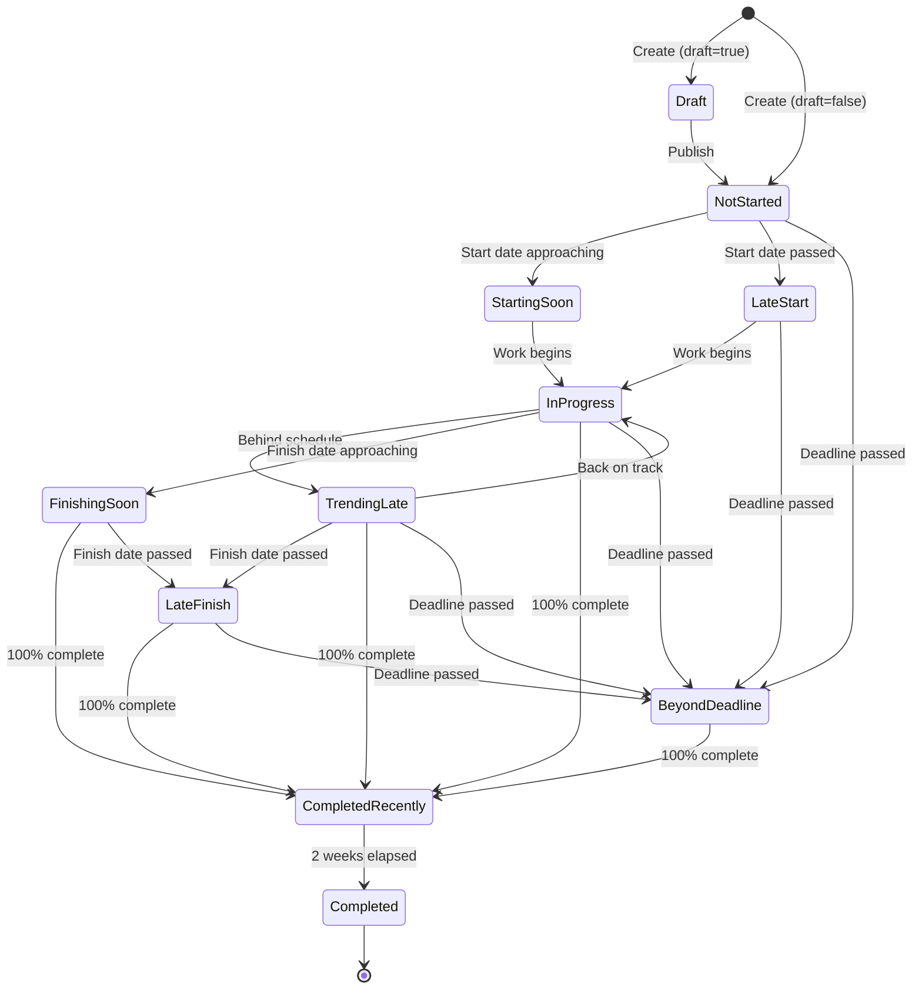

### 1.2 State Definitions

| State | Indicator | Severity | Trigger |
|-------|-----------|----------|---------|
| Draft | (none) | - | draft=true |
| Not Started | Not Started | upcoming | 0%, has dates |
| Starting Soon | Starting Soon! | upcoming | Start within 2 weeks |
| Late Start | Late Start!! | critical | Start date passed, 0% |
| In Progress | In Progress | active | 1-99% complete |
| Trending Late | Trending Late! | warning | Remaining work > remaining time |
| Finishing Soon | Finishing Soon! | active | Finish within 2 weeks |
| Late Finish | Late Finish!! | critical | Finish passed, < 100% |
| Beyond Deadline | Beyond Deadline!!! | critical | Deadline passed |
| Completed Recently | Completed Recently | completed | 100%, within 2 weeks |
| Completed | Completed | done | 100%, > 2 weeks ago |

### 1.3 Indicator Calculation Rules

```python
def calculate_indicator(item: Item, today: date) -> str:
    """Calculate indicator based on precedence."""

    # Draft items get no indicator
    if item.draft:
        return None

    # Precedence order (highest to lowest):

    # 1. Completed Recently
    if item.percent_complete == 100:
        if item.finish and item.finish >= today - timedelta(days=14):
            return "Completed Recently"
        return "Completed"

    # 2. Beyond Deadline
    if item.deadline and item.deadline < today:
        return "Beyond Deadline!!!"

    # 3. Late Finish
    if item.finish and item.finish < today:
        return "Late Finish!!"

    # 4. Late Start
    if item.start and item.start < today and item.percent_complete == 0:
        return "Late Start!!"

    # 5. Trending Late
    if item.start and item.finish and item.duration:
        remaining_days = (item.finish - today).days
        remaining_work = (1 - item.percent_complete / 100) * item.duration
        if remaining_work > remaining_days:
            return "Trending Late!"

    # 6. Finishing Soon
    if item.finish and item.finish <= today + timedelta(days=14):
        return "Finishing Soon!"

    # 7. Starting Soon
    if item.percent_complete == 0 and item.start:
        if today <= item.start <= today + timedelta(days=14):
            return "Starting Soon!"

    # 8. In Progress
    if 0 < item.percent_complete < 100:
        return "In Progress"

    # 9. Not Started (has dates but 0%)
    if item.start or item.finish:
        return "Not Started"

    return None
```

---

## 2. Authentication Flow

### 2.1 Email/Password Login

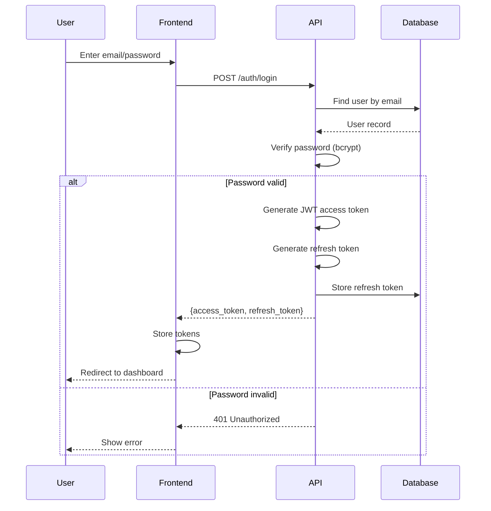

### 2.2 OAuth Flow

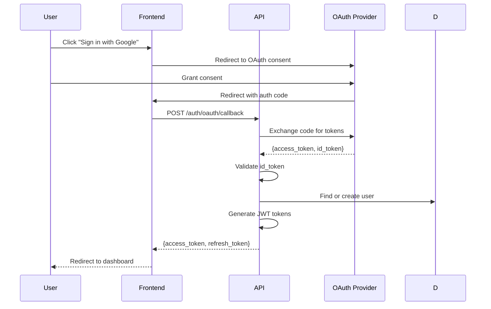

### 2.3 Token Refresh

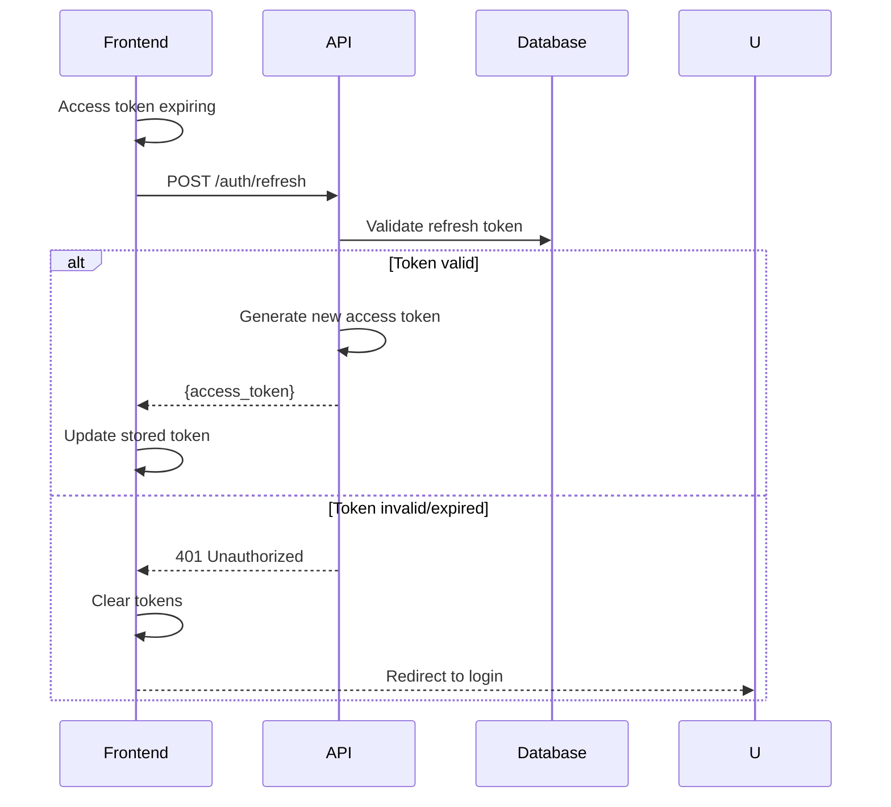

---

## 3. Item CRUD Flow

### 3.1 Create Item

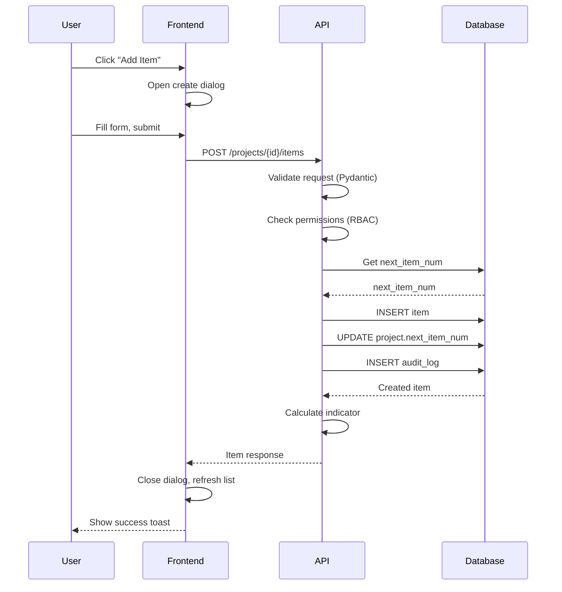

### 3.2 Update Item

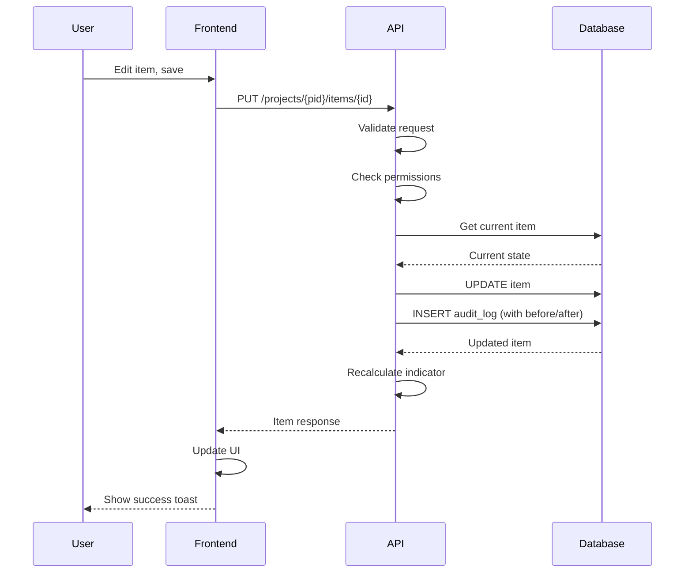

---

## 4. Budget Calculation Flow

### 4.1 Calculate Metrics

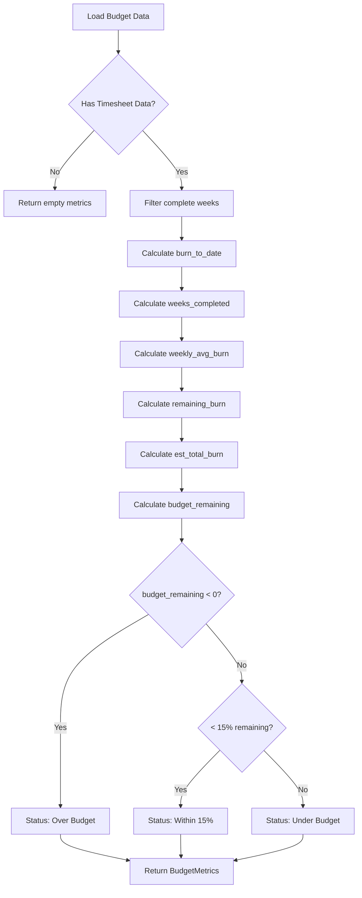

### 4.2 Weekly Burn Calculation

```python
def calculate_weekly_burn(timesheet_entries: list) -> list[WeeklyBurn]:
    """Calculate weekly burn with cumulative."""
    by_week = defaultdict(float)

    for entry in timesheet_entries:
        if entry.complete_week:
            by_week[entry.week_ending] += entry.cost

    weekly_burn = []
    cumulative = 0.0

    for week in sorted(by_week.keys()):
        cost = round(by_week[week], 2)
        cumulative = round(cumulative + cost, 2)
        weekly_burn.append(WeeklyBurn(
            week_ending=week,
            cost=cost,
            cumulative=cumulative
        ))

    return weekly_burn
```

---

## 5. AI Chat Flow

### 5.1 Send Message

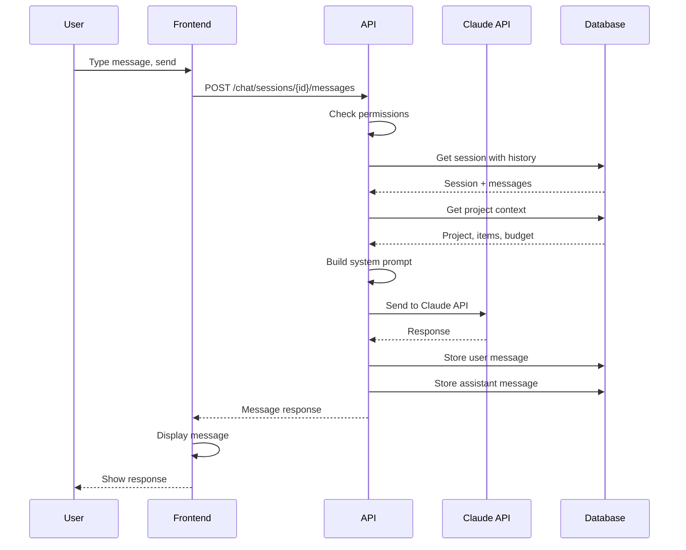

### 5.2 Context Building

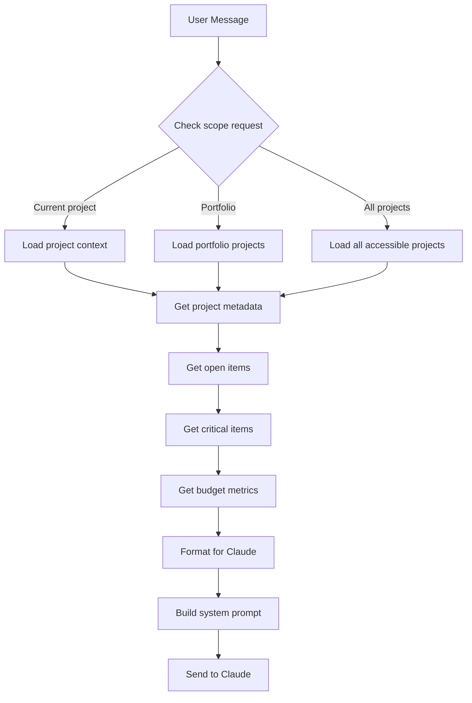

### 5.3 RBAC Enforcement

```python
async def get_chat_context(
    user_id: UUID,
    project_id: UUID,
    scope: str
) -> ChatContext:
    """Get context respecting RBAC."""

    if scope == "current":
        # Verify access to project
        if not await has_project_access(user_id, project_id):
            raise AuthorizationError("No access to project")
        return await build_project_context(project_id)

    elif scope == "portfolio":
        # Get portfolio and verify access to all projects
        portfolio = await get_portfolio_for_project(project_id)
        projects = await get_accessible_portfolio_projects(user_id, portfolio.id)
        return await build_portfolio_context(projects)

    elif scope == "all":
        # Get all user's accessible projects
        projects = await get_user_accessible_projects(user_id)
        return await build_multi_project_context(projects)
```

---

## 6. Multi-Tenancy Flow

### 6.1 Request Routing

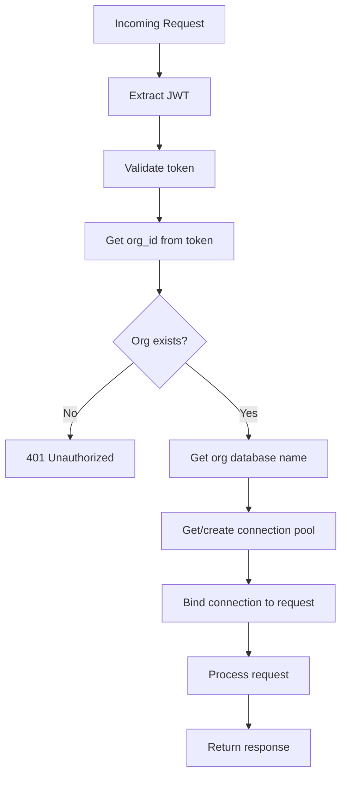

### 6.2 Organization Database Selection

```python
async def get_org_connection(org_id: UUID) -> asyncpg.Pool:
    """Get database connection for organization."""
    # Check cache
    if org_id in connection_pools:
        return connection_pools[org_id]

    # Get org from central DB
    org = await central_db.get_organization(org_id)
    if not org:
        raise NotFoundError("Organization", str(org_id))

    # Create pool for org database
    pool = await asyncpg.create_pool(
        database=org.database_name,
        **connection_settings
    )

    connection_pools[org_id] = pool
    return pool
```

---

## 7. Export Flow

### 7.1 Generate Export

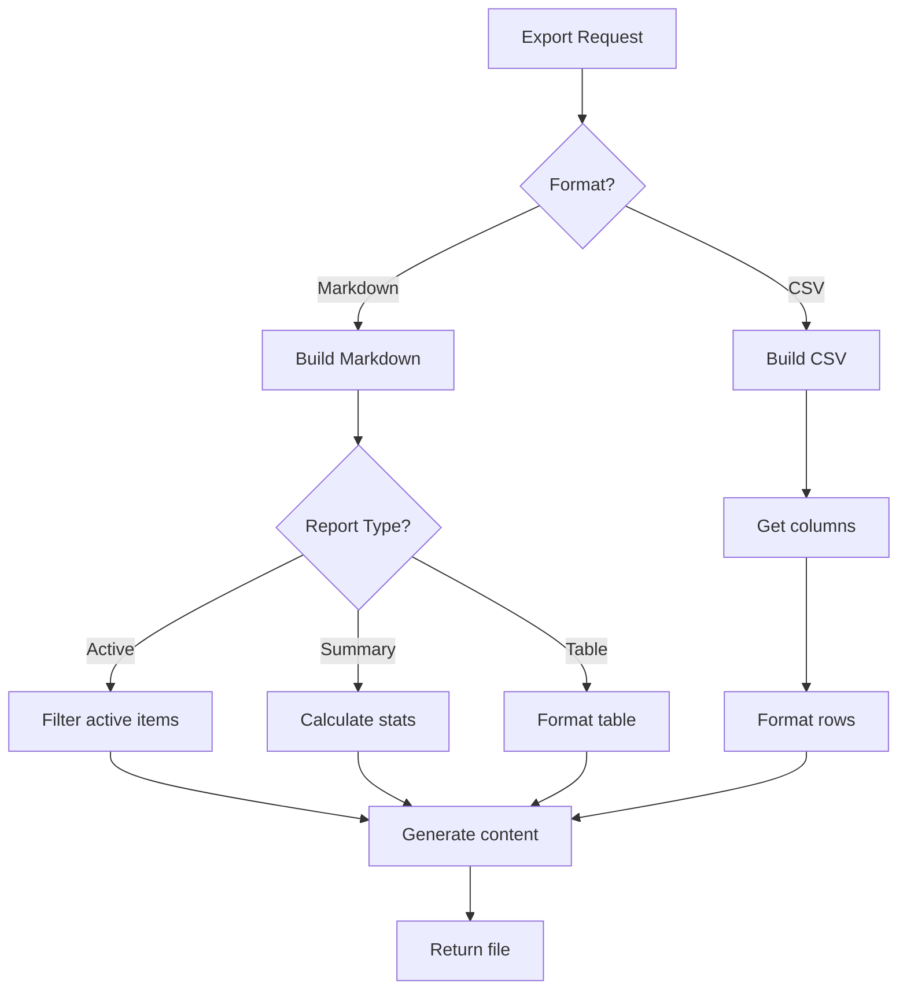

---

## 8. Permission Check Flow

### 8.1 API Endpoint Check

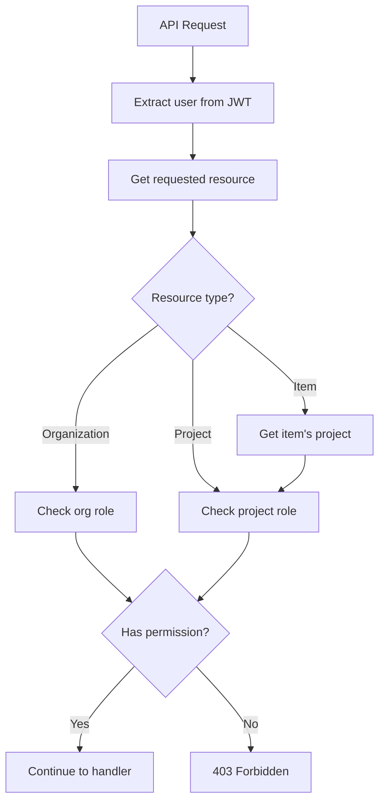

### 8.2 Permission Matrix

| Action | Admin | Project Manager | Team Member | Viewer |
|--------|-------|-----------------|-------------|--------|
| View project | Yes | Yes | Yes | Yes |
| Create item | Yes | Yes | Assigned only | No |
| Edit item | Yes | Yes | Assigned only | No |
| Delete item | Yes | Yes | No | No |
| Edit project | Yes | Yes | No | No |
| Manage team | Yes | No | No | No |
| View budget | Yes | Yes | Yes | Yes |
| Edit budget | Yes | Yes | No | No |

---

## Related Documentation

| Document | Purpose |
|----------|---------|
| [REQUIREMENTS.md](REQUIREMENTS.md) | Business requirements |
| [USER_STORIES.md](USER_STORIES.md) | Implementation stories |
| [DATA_MODEL.md](DATA_MODEL.md) | Database schema |
| [ARCHITECTURE.md](ARCHITECTURE.md) | System design |
| [PATTERNS.md](PATTERNS.md) | Code patterns |
